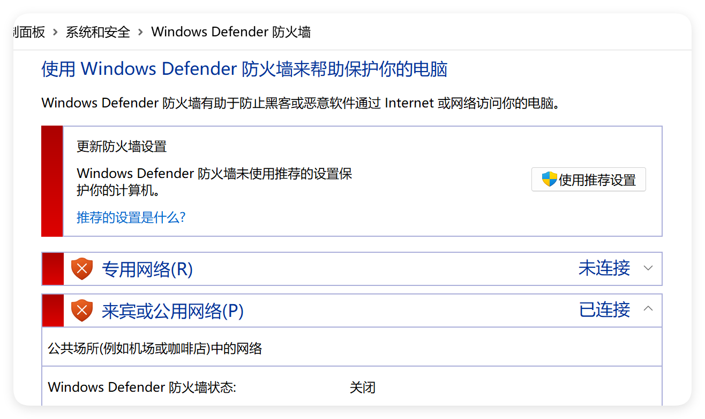

## 问题描述

在使用 Web Socket 进行实时通信时，发现链接失败的问题。在自己的环境中测试时没有问题。

其中在自己的测试环境中，使用的是 8080 端口。而在后端同时开发的环境中，使用的是 其他 端口。

## 解决方案

关闭 windows 自带 的防火墙。因为 8080 端口是防火墙默认开放的端口，所以自己环境测试时没有问题。

而链接其他环境时，连接的是其他端口，所以需要在防火墙中开放该端口。或者关闭防火墙。

