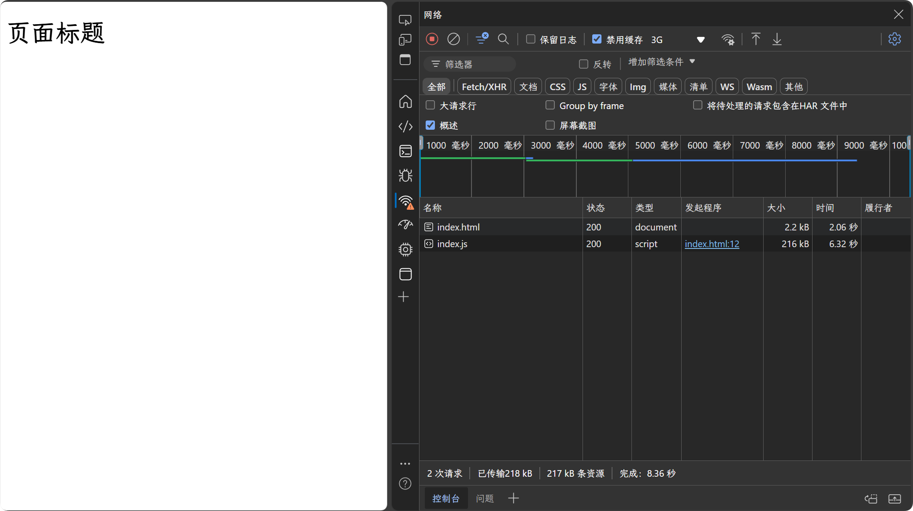
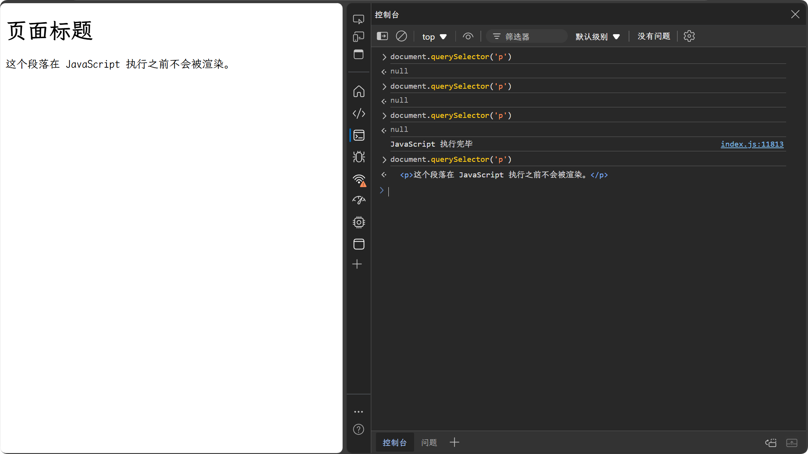
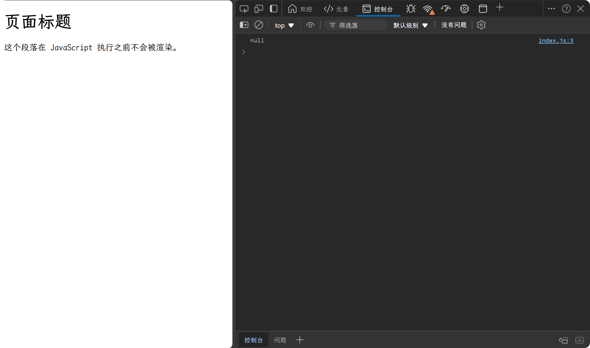
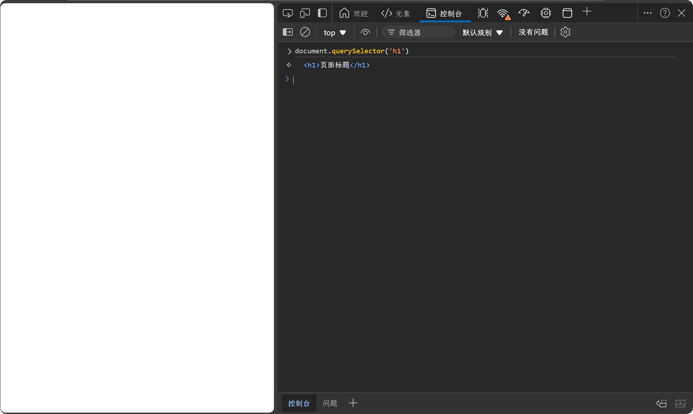
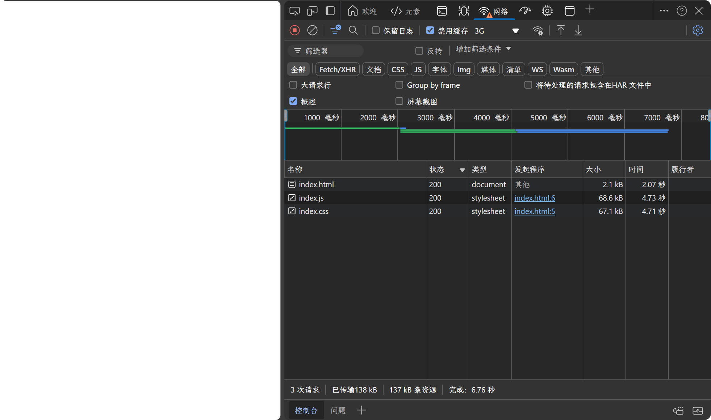
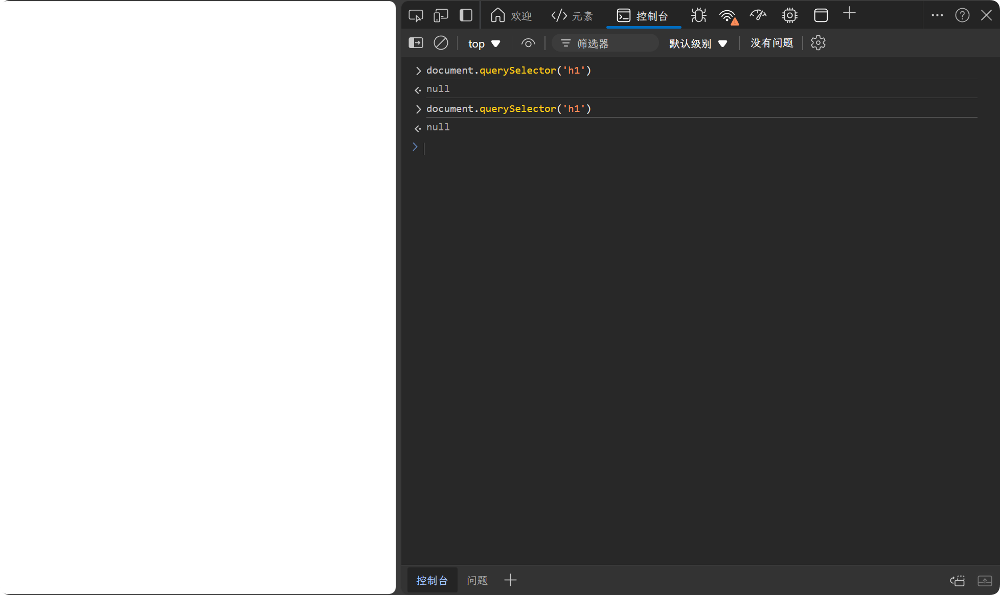
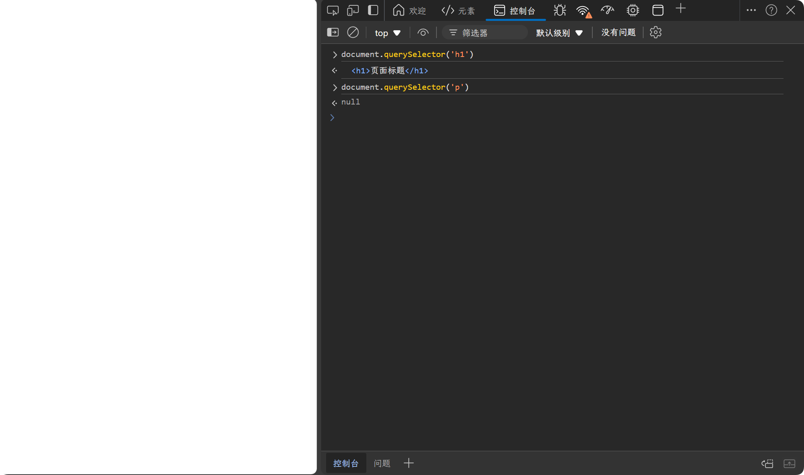

# 页面加载流程 以及 CSS 与 JavaScript 的加载阻塞

## 页面加载流程

1. **解析 HTML**：浏览器从服务器获取 HTML 文档，并解析 HTML 文档，构建 DOM 树。
   
   -  在 HTML 文档解析过程中，当解析器遇到一个非阻塞资源（如一个异步脚本）时，它会尝试并行下载资源，同时继续解析文档。
   -  如果遇到 `<script>` 并且没有 `defer` 或 `async` 属性，浏览器会停止解析 HTML，先执行 JavaScript，然后再继续解析 HTML。
   -  如果遇到 `<link>` 标签，会异步加载CSS，不会阻塞HTML解析。需要注意，CSS 加载不会阻塞 HTML 解析，但会阻塞渲染。
 
  
2. **解析 CSS**：浏览器解析 CSS 文档，构建 CSSOM 树。
   -  注意，CSS 加载不会阻塞 HTML 解析，但会阻塞渲染。因为浏览器需要等待 CSS 文件加载完成，才能构建渲染树。需要 DOM 和 CSSOM 树都构建完成，才能开始渲染页面。
  
3. **构建渲染树**：浏览器将 DOM 树和 CSSOM 树合并，构建渲染树。
   - 加载 CSS 文件时，会阻塞渲染，因为浏览器需要等待 CSS 文件加载完成，才能构建渲染树。
   - 加载 JavaScript 文件时，不仅会阻塞渲染，还会阻塞 HTML 解析。
  
4. **布局**：浏览器计算渲染树中每个节点的位置和大小，生成布局。
5. **绘制**：浏览器将渲染树中的每个节点绘制到屏幕上。

## 加载阻塞

先说结论：

-  JavaScript 加载会阻塞 HTML 解析和渲染。
-  JavaScript 执行会阻塞 HTML 解析和渲染。

- CSS 加载不会阻塞 HTML 解析，但会阻塞渲染。
- CSS 加载不会阻塞 JavaScript 的加载，但是会阻塞 JavaScript 的执行。

下面为详细验证过程：


## JavaScript 阻塞

### 加载会阻塞解析和渲染

我们通过代码验证，如下：我们创建一个 HTML 文件，引入一个 JavaScript 文件。我们在 `index.js` 添加一些注释，让整体文件变大。并且在浏览器中打开开发者工具，限速网络，观察加载情况。

```html
<!DOCTYPE html>
<html lang="en">
  <head>
    <meta charset="UTF-8" />
    <title>JavaScript加载会阻塞解析和渲染</title>
  </head>
  <body>
    <h1>页面标题</h1>
    <script src="./index.js"></script>
    <p>这个段落在 JavaScript 执行之前不会被渲染。</p>
  </body>
</html>
```


如上图，我们禁用缓存，并且设置网络限速为慢速3G，打开开发者工具，观察加载情况。

我们发现在 `index.js` 加载过中，只有 `h1` 标签被渲染了，`p` 标签并没有被渲染。这说明 JavaScript 加载首先会阻止HTML的渲染。但是只会阻塞 script 标签之后的 HTML 渲染，不会阻塞 script 标签之前的 HTML 渲染。




首先我们知道，浏览器在解析 HTML 是为了构建 DOM 树。

因此在 `index.js` 加载过程中，在控制台使用 `document.querySelector('p')` 获取位于 script 标签后面的元素。发现获取不到元素，说明在 JavaScript 加载过程中，HTML 解析被阻塞了。 

但是我们可以通过 `document.querySelector('h1')` 获取到元素，说明在 JavaScript 加载过程中，HTML 解析渲染并没有被完全阻塞。只有 script 标签之后的 HTML 解析渲染被阻塞了。

如上图，只有等待 `index.js` 加载执行完成之后，`p` 标签才会被解析渲染。


通过以上验证，我们可以得出结论：**JavaScript 加载会阻塞 HTML 解析和渲染。**，但是只会阻塞 script 标签之后的 HTML 解析渲染，不会阻塞 script 标签之前的 HTML 解析渲染。

### 执行会阻塞解析和渲染

如上面示例中的代码和设置，我们只需修改 `index.js` 文件，添加一些代码，让 JavaScript 执行时间变长。
```js
const start = performance.now()
while (performance.now() - start < 5000) {}
console.log(document.querySelector('p'))
```
`performance.now()`：返回一个高精度的时间戳，单位为毫秒，表示自页面加载以来的时间。它比 Date.now() 更精确，适合用于性能测量。

我们通过 `performance.now()` 获取 JavaScript 执行开始的时间，然后通过 `while` 循环让 JavaScript 执行时间变长，直到超过 5000 毫秒。然后通过 `console.log` 输出 `p` 标签。

如果 JavaScript 执行不会阻塞 HTML 解析和渲染，那么在 JavaScript 执行的过程中，`p` 标签应该被解析和渲染。



但是实际上，上面示例中，打印的结果是 `null`，并且，在 JavaScript 执行的过程中，在页面上并没有看到 `p` 标签被渲染。说明 JavaScript 执行会阻塞 HTML 解析和渲染。


### defer 和 async

  
`defer`：

- 加载方式：当使用 defer 属性时，脚本会在文档解析时异步加载，但会在文档完全解析后（即在 DOMContentLoaded 事件之前）执行。
- 执行顺序：如果有多个带有 defer 属性的脚本，它们会按照在文档中出现的顺序依次执行。
- 适用场景：适合需要在 DOM 完全加载后执行的脚本，尤其是当脚本依赖于 DOM 元素时。
  
`async`：

- 加载方式：当使用 async 属性时，脚本会异步加载，并且一旦加载完成就立即执行，而不管文档的解析状态。
- 执行顺序：如果有多个带有 async 属性的脚本，它们的执行顺序是不确定的，取决于哪个脚本先加载完成。
- 适用场景：适合独立的脚本，不依赖于其他脚本或 DOM 元素的情况，例如分析工具或广告脚本。


我们给上面示例中的 `script` 标签添加 `defer` 和 `async` 属性之后，JavaScript的加载不会影响 HTML 解析。

但是 JavaScript 加载之后执行，如果这个时候 HTML 解析还没有完成，那么 JavaScript 执行会阻塞 HTML 解析和渲染。

## CSS 阻塞


### 加载不会阻塞解析，会阻塞渲染。


我们同样通过示例来验证，设置一个较大的 `index.css` 文件（添加较多注释即可），然后在控制限制网速。


```html
<!DOCTYPE html>
<html lang="en">
  <head>
    <meta charset="UTF-8" />
    <title>CSS加载会阻塞渲染</title>
    <link rel="stylesheet" href="./index.css" />
  </head>
  <body>
    <h1>页面标题</h1>
  </body>
</html>
```


我们在页面加载的时候，通过 `document.querySelector('h1')` 获取 `h1` 标签，发现可以获取到元素，但是页面上并没有渲染 `h1` 标签。说明 CSS 加载会阻塞渲染。但是不会阻塞解析。


### 加载会阻塞 JavaScript 执行

和上面设置一样，我们先验证 CSS 加载会不会阻塞 JavaScript 加载。

```html
<!DOCTYPE html>
<html lang="en">
  <head>
    <meta charset="UTF-8" />
    <title>CSS会阻塞 JavaScript 执行</title>
    <link rel="stylesheet" href="./index.css" />
    <script src="./index.js"></script>
  </head>
  <body>
    <h1>页面标题</h1>
  </body>
</html>
```


可以看到 CSS 和 JavaScript 文件几乎同时开始加载，说明 CSS 加载不会阻塞 JavaScript 加载。

但是 JavaScript 加载会阻塞 HTML 解析和渲染，所以页面上并没有渲染 `h1` 标签。也获取不到 `h1` 标签。


下面我们来验证 CSS 加载会不会阻塞 JavaScript 执行。

```html
<!DOCTYPE html>
<html lang="en">
  <head>
    <meta charset="UTF-8" />
    <title>CSS会阻塞 JavaScript 执行</title>
    <link rel="stylesheet" href="./index.css" />
    <script src="./index.js"></script>
  </head>
  <body>
    <h1>页面标题</h1>
    <script>
        console.log('javaScript 执行')
    </script>
    <p>这个段落在 JavaScript 执行之前不会被渲染。</p>
  </body>
</html>
```



我们可以看到，在加载 `index.css` 文件的时候，控制台并没有打印 `javaScript 执行`，说明 CSS 加载会阻塞 JavaScript 执行。

因为 CSS 加载会阻塞 HTML渲染，所以页面上并没有渲染 `h1` 标签，但是我们可以获取到 `h1` 标签。

因为 JavaScript 执行会阻塞 HTML 解析和渲染。所以我们获取不到 `p` 标签。页面上也没有渲染 `p` 标签。


