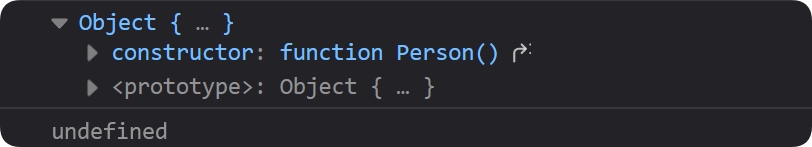
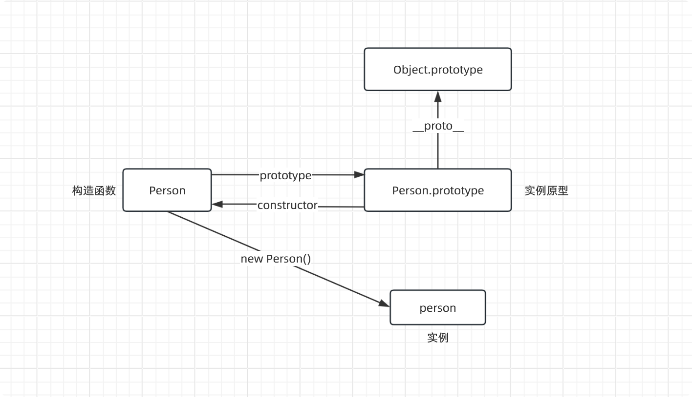
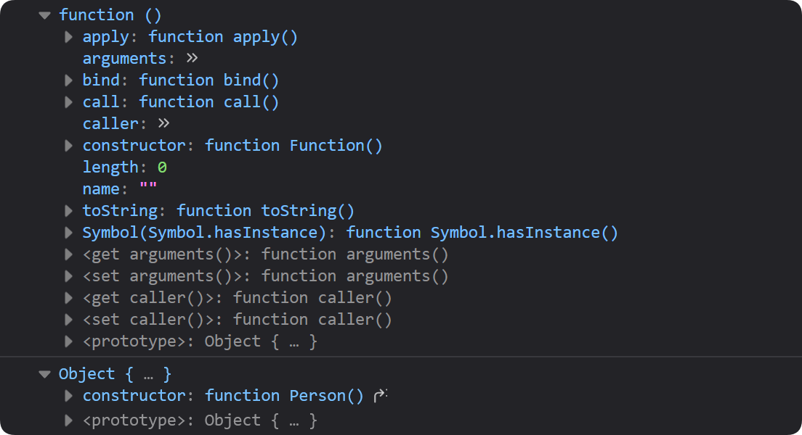
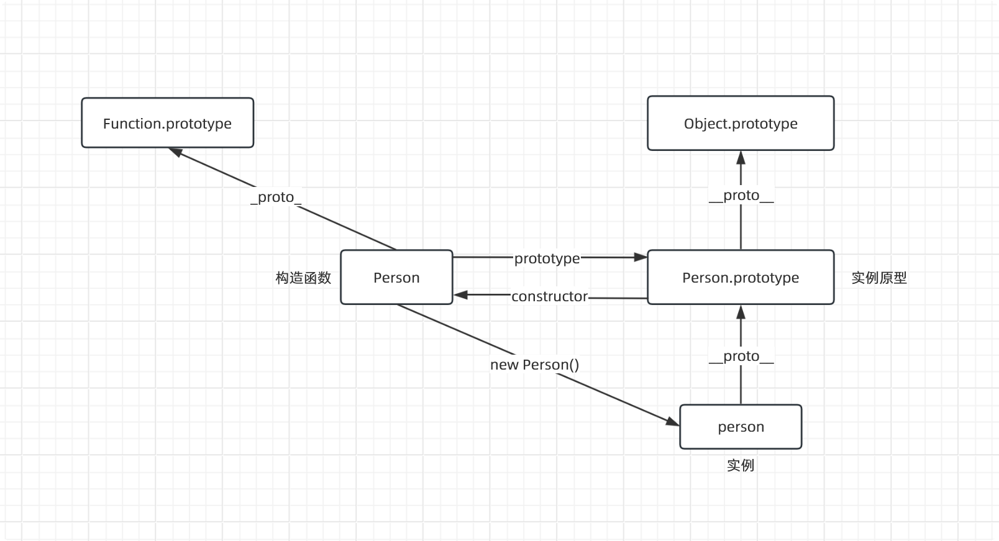
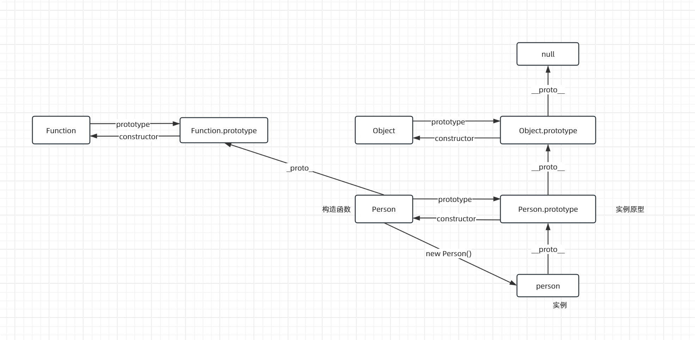
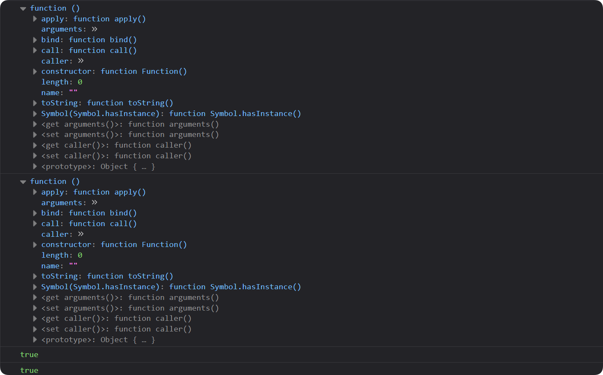
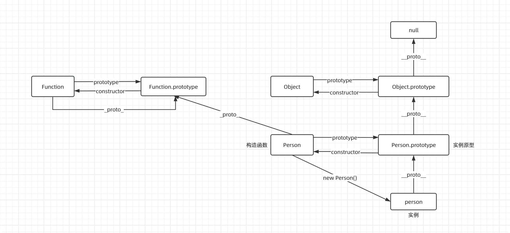
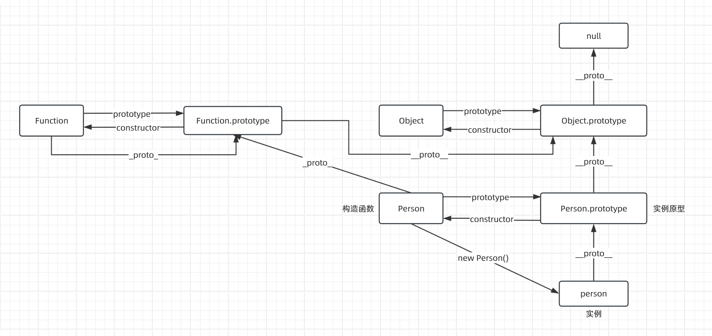
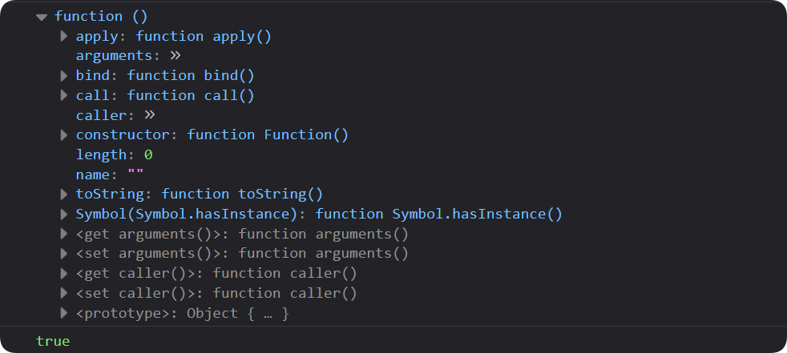
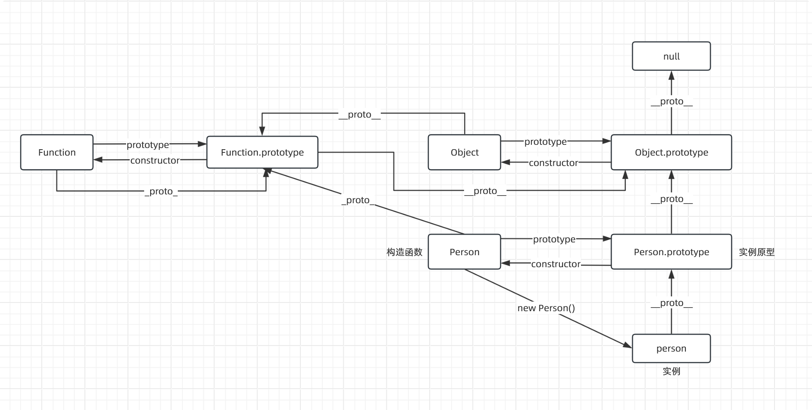

# JavaScript-原型链解析

本篇通过 图解 和 示例 重新梳理一下 JavaScript 中的原型链。


### 原型

> 每个对象都有一个与之关联的另一个对象，这个对象称为原型，并且该对象的所有属性和方法都被关联对象的实例所共享。

### 原型链

> 当访问一个对象的属性时，如果这个对象内部不存在这个属性，那么它就会去它的原型对象里找这个属性，这个原型对象又会有自己的原型，于是就这样一直找下去，也就是原型链的概念。原型链的尽头一般来说都是 `Object.prototype` ，最后就是 `null`。

### `prototype`

> 每个函数都有一个 prototype 属性，这个属性是一个对象，这个对象包含了通过构造函数创建的所有实例共享的属性和方法。也就是说，当我们创建一个函数时，JavaScript 会自动为这个函数创建一个 prototype 对象，并且这个对象有一个 constructor 属性，指向这个函数。
>

- 特别注意：只有函数对象才有 prototype 属性，普通对象是没有的。
```js
function Person() {}
console.log(Person.prototype) // object {constructor: ƒ Person(), <prototype>: Object}

const person = new Person()
console.log(person.prototype) // undefined
```

`Person.prototype` 是一个对象，它通常包含以下两个属性：

-   `constructor`：`constructor` 属性指向创建该原型对象的构造函数。在上面例子中， `Person.prototype.constructor` 将指向 `Person`。

```js
function Person() {}
console.log(Person.prototype.constructor === Person) // true
```

-   `<prototype>`：`<prototype>` 是一个表示原型链的概念，通常用 `__proto__` 来表示。每个对象都有一个 `__proto__` 属性，它指向该对象的原型对象。对于 `Person.prototype` 来说，它的 `__proto__` 属性指向 `Object.prototype`，因为所有对象最终都继承自 `Object`。 

```js
function Person() {}
console.log(Person.prototype.__proto__ === Object.prototype) // true
```
用图表示如下：


### `__proto__`

> 每个对象都有一个 `__proto__` 属性，这个属性指向该对象的原型。当我们访问一个对象的属性时，如果这个对象内部不存在这个属性，那么它就会去它的 `__proto__` 属性指向的对象里找这个属性，这个 `__proto__` 属性又会有自己的 `__proto__` 属性，于是就这样一直找下去，也就是原型链的概念。原型链的尽头一般来说都是 `Object.prototype` ，最后就是 `null`。

```js
function Person() {}
const person = new Person()

console.log(Person.__proto__)  // function () { [native code] }
console.log(person.__proto__) // object {constructor: ƒ Person(), <prototype>: Object}
```


如上，`Person.__proto__` 是一个函数对象，它指向 `Function.prototype`，因为所有函数最终都继承自 `Function`。 也就是说，Perosn 是由 `Function` 构造函数创建的一个实例。
```js
console.log(Person.__proto__ === Function.prototype) // true
```
`person.__proto__` 是一个对象，它指向 `Person.prototype`，因为 `person` 是通过 `Person` 构造函数创建的。

```js
console.log(person.__proto__ === Person.prototype) // true
```
更新图表示如下：



### `constructor`

> 每个原型对象都有一个 constructor 属性，这个属性指向该原型对象对应的构造函数。也就是说，当我们创建一个函数时，JavaScript 会自动为这个函数创建一个 prototype 对象，并且这个对象有一个 constructor 属性，指向这个函数。


```js
console.log(Person.prototype.constructor === Person) // true
```

再上面图表中，只列出了 `Function.prototype` 和 `Object.prototype`。我们添加上 Function 和 Object 构造函数和 `Function.prototype` 和 `Object.prototype` 的关系。

同时更新一下原型链的尽头 `null`。即 `Object.prototype.__proto__` 指向 `null`。

更新图表如下：



## Function

Function 是 JavaScript 中所有函数的构造函数。

也就是说，所有的函数都是通过 `Function` 构造函数创建的实例。同时，Function 本身也是一个函数，它也是通过 `Function` 构造函数创建的实例。 

因此，`Function.prototype` 与 `Function.__proto__` 指向同一个对象。 `Function.prototype` 和 `Function.__proto__` 是相等的。


我们通过代码来验证一下：

```js
console.log(Function.prototype)
console.log(Function.__proto__)
console.log(Function.__proto__ == Function.prototype) // true
console.log(Function.prototype.__proto__ === Object.prototype) // true
```


我们更新一下图表：




 `Function.prototype` 也有一个 `__proto__` 属性，它指向 `Object.prototype`，因为所有对象最终都继承自 `Object`。
```js
console.log(Function.prototype.__proto__ === Object.prototype) // true
```
更新图表如下：


## Object

所有对象的最顶层原型都是 `Object.prototype` 包括普通对象和函数对象。

而 `Object.prototype` 的原型是 `null`。

```js
console.log(Object.prototype.__proto__ === null) // true

function Person() {}
const person = new Person()

console.log(Person.prototype.__proto__ === Object.prototype) // true
console.log(person.__proto__.__proto__ === Object.prototype) // true
```

而 `Object` 本身也是一个函数，它也是通过 `Function` 构造函数创建的实例。因此，`Object.__proto__` 指向 `Function.prototype`。

```js
console.log(Object.__proto__)
console.log(Object.__proto__ === Function.prototype) // true
```


我们更新一下图表：




## 总结

总的来说，涉及原型链一共有三个重要点：`prototype`、`__proto__` 和 `constructor`。

-   `prototype`：每个函数都有一个 `prototype` 属性，这个属性指向该函数的原型对象。原型对象是一个普通的对象，它有一个 `constructor` 属性，指向该函数。
-   `__proto__`：每个对象都有一个 `__proto__` 属性（函数对象也有该属性）这个属性指向该对象的原型。原型对象也有一个 `__proto__` 属性，指向它的原型。这样一层一层地往上找，就形成了一个原型链。
-   `constructor`：每个原型对象都有一个 `constructor` 属性，这个属性指向该原型对象对应的构造函数。


我们可以通过不断来的打印和对比函数和对象的`prototype`、`__proto__`，来找出原型链的规律。