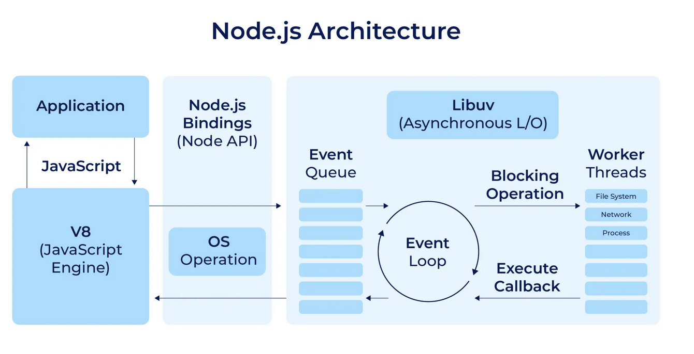

# Node.js底层实现 - 简单了解

## Node.js是什么

Node.js是一个基于Chrome V8引擎的JavaScript运行环境，它允许开发者使用JavaScript编写服务器端代码。Node.js使用事件驱动和非阻塞I/O模型，使得它非常适合处理高并发和I/O密集型任务。

架构图：



## V8引擎

V8引擎是Node.js的核心，它负责将JavaScript代码编译成机器码并执行。V8引擎是开源的，由Google开发，并且在Chrome浏览器中得到了广泛的应用。V8引擎的性能非常优秀，它能够将JavaScript代码编译成高效的机器码，使得Node.js能够在服务器端高效地运行JavaScript代码。


## Node.js Bindings(Node API)

Node.js Bindings是Node.js与C++代码之间的桥梁。Node.js Bindings允许开发者使用C++编写扩展模块，并将它们编译成JavaScript模块，以便在Node.js中使用。Node.js Bindings使用C++编写，它提供了对Node.js API的访问，使得开发者可以访问Node.js的底层功能，如文件系统、网络、子进程等。


## libuv

libuv是一个跨平台的异步I/O库，它提供了对文件系统、网络、子进程等操作的封装。Node.js使用libuv库来处理异步I/O操作，它使得Node.js能够在单线程中处理大量并发请求。libuv库是开源的，由Joyent公司开发，并且在Node.js中得到广泛的应用。


在 Node.js 有主要有三部分组成：

### 事件队列(Event Queue)


事件队列是一个保存所有待处理事件的数据结构。每个事件通常对应于一个回调函数，当事件发生时（例如，I/O 操作完成），该回调函数将被调用。在 Node.js 中，事件可以是定时器触发、文件系统操作完成、网络请求响应等。


### 事件循环(Event Loop)

事件循环是 Node.js 处理异步 I/O 操作的核心机制。它不断地循环遍历事件队列，并分发事件给相应的回调函数执行。事件循环的工作流程如下：

1. 检查事件队列中是否有待处理的事件。
2. 如果有，则取出第一个事件，并执行相应的回调函数。
3. 如果没有，则等待直到有事件加入队列。
4. 重复上述步骤，直到程序退出。

事件循环是单线程的，这意味着同一时间只能处理一个事件。但是，由于 Node.js 使用事件驱动和非阻塞 I/O 模型，它能够高效地处理大量并发请求。

### 工作线程(Worker Threads)

工作线程就是具体负责执行指令的线程。它从事件循环接收到任务和指令并开始执行。工作线程由libuv负责管理和调度。通过工作线程，livuv可以执行不同的具体的任务和类型，通常都是比较耗时或者不能确定执行时间的任务，比如文件操作、网络数据传输、数据库操作、长时间的密集计算、外部程序调用等等。


## Node.js API

Node.js API 是 Node.js 提供的一组用于访问操作系统资源和执行各种任务的接口。这些 API 包括文件系统操作、网络通信、子进程管理、定时器、事件处理等。Node.js API 是基于 V8 引擎和 libuv 库构建的，它提供了对底层功能的访问，使得开发者可以编写高效、可扩展的服务器端应用程序。


### 文件系统

Node.js 提供了 `fs` 模块，用于处理文件系统操作。它提供了读取、写入、删除、重命名等文件操作的方法，以及读取目录内容、创建和删除目录等目录操作的方法。`fs` 模块支持同步和异步两种方式执行文件操作，开发者可以根据需要选择合适的方式。


```js
const fs = require('fs');

// 异步读取文件
fs.readFile('file.txt', 'utf8', (err, data) => {
  if (err) throw err;
  console.log(data);
})

// 写入文件
fs.writeFile('file.txt', 'Hello, world!', (err) => {
  if (err) throw err;
  console.log('The file has been saved!');
})
```

### 网络

Node.js 提供了 `http` 和 `https` 模块，用于处理网络通信。它提供了创建 HTTP 服务器和客户端的方法，以及处理 HTTP 请求和响应的方法。开发者可以使用这些模块来构建 Web 服务器、发送 HTTP 请求、处理 WebSocket 连接等。

```js
const http = require('http');

// 创建 HTTP 服务器
const server = http.createServer((req, res) => {
  res.statusCode = 200;
  res.setHeader('Content-Type', 'text/plain');
  res.end('Hello, world!\n');
});

server.listen(3000, '127.0.0.1', () => {
  console.log('Server running at http://127.0.0.1:3000/');
})
```


## 其他内置库

Node.js 除了 V8 和 其他相关API，还集成了一些优秀的第三方库，比如：crypto 和 zlib。

### crypto

crypto 是 Node.js 的内置库，它提供了加密和解密的功能。它支持多种加密算法，如 AES、DES、RSA 等。crypto 库可以用于生成随机数、创建哈希值、加密和解密数据等。

### zlib

zlib 是 Node.js 的内置库，它提供了压缩和解压缩的功能。它支持多种压缩算法，如 gzip、deflate 等。zlib 库可以用于压缩和解压缩数据，以提高数据传输效率和存储空间利用率。


## Node.js与浏览器的区别

Node.js与浏览器中的JavaScript有一些关键的区别：

1. 运行环境不同：Node.js在服务器端运行，而浏览器中的JavaScript在客户端运行。这意味着Node.js可以访问服务器端的资源，如文件系统、网络接口等，而浏览器中的JavaScript只能访问客户端的资源，如DOM、浏览器API等。
2. 全局对象不同：Node.js有一个全局对象`global`，而浏览器中有一个全局对象`window`。`global`对象包含了Node.js特有的全局变量和函数，如`require()`、`module.exports`、`process`等。
3. 模块系统不同：Node.js使用CommonJS模块系统，而浏览器使用ES6模块系统。CommonJS模块系统使用`require()`和`module.exports`来导入和导出模块，而ES6模块系统使用`import`和`export`来导入和导出模块。


## Node.js与浏览器的相同点

尽管Node.js与浏览器中的JavaScript有一些关键的区别，但它们也有一些相同点：

1. JavaScript语法相同：Node.js和浏览器中的JavaScript都使用相同的JavaScript语法，包括变量声明、函数定义、控制流语句等。
2. 标准库相同：Node.js和浏览器中的JavaScript都使用相同的ECMAScript标准库，包括字符串、数组、对象、函数等。
3. 第三方库相同：Node.js和浏览器中的JavaScript都可以使用第三方库，如jQuery、React、Vue等。这些库可以在Node.js和浏览器中无缝使用。
4. 事件驱动和非阻塞I/O模型：Node.js和浏览器中的JavaScript都使用事件驱动和非阻塞I/O模型，这使得它们非常适合处理高并发和I/O密集型任务。

