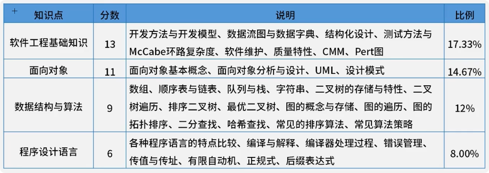
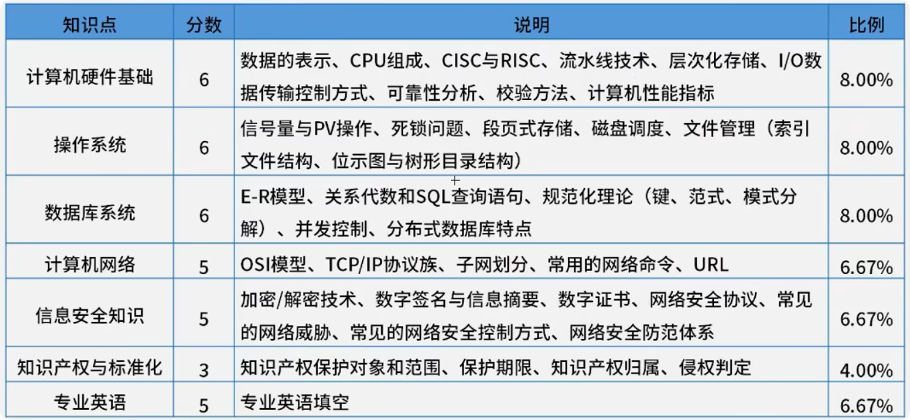
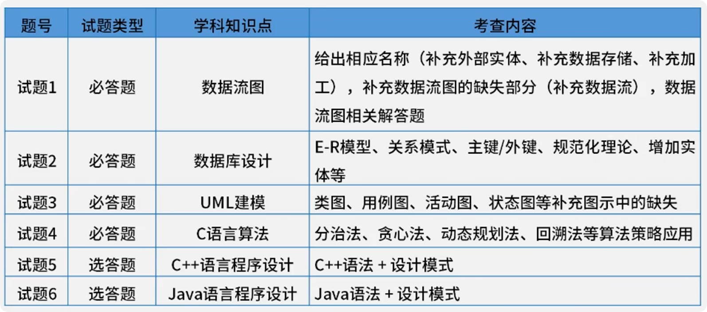
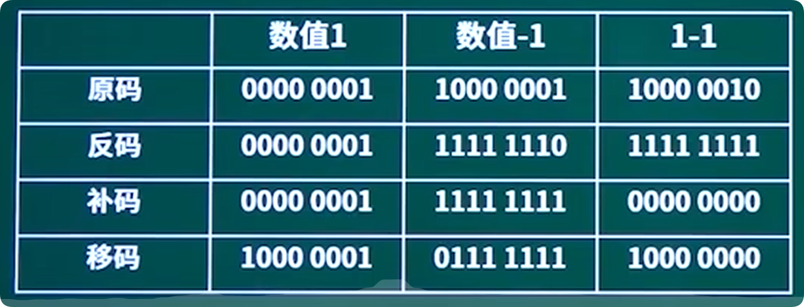

## 考试内容

## 数据的表示 

### 进制转换

-   十进制（D） 位权（10**K）
-   二进制（B） 位权（2**K）
-   十六进制（H） 位权（16**K）

1. 其他进制转十进制
   -   二进制转十进制  计算方式：从右往左，每一位乘以2的n次方，n从0开始，然后求和
   -   十六进制转十进制  计算方式：从右往左，每一位乘以16的n次方，n从0开始，然后求和
  
2. 十进制转其他进制
   -   十进制转二进制  计算方式：除以2，取余数，然后倒序排列
   -   十进制转十六进制  计算方式：除以16，取余数，然后倒序排列

3. 二进制转十六进制或八进制
   -    二进制转十六进制  计算方式：从右往左，每四位一组，不足四位补0，然后转换为十六进制
   -    二进制转八进制  计算方式：从右往左，每三位一组，不足三位补0，然后转换为八进制
   -    同理，十六进制转二进制，八进制转二进制，也是从右往左，每四位或每三位一组，不足四位或三位补0，然后转换为二进制
### 码制
- 原码
- 反码：正数
- 补码： 
- 移码
  
固定长度八位：

加减运算一般不用原码，因为原码的减法运算比较复杂，所以一般用补码来表示负数，补码的加法运算比较简单，所以一般用补码来表示负数。

### 浮点数的表示 

### 逻辑运算